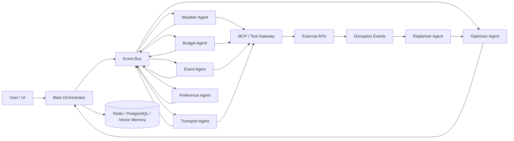
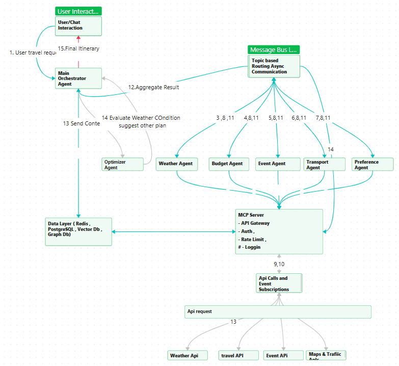
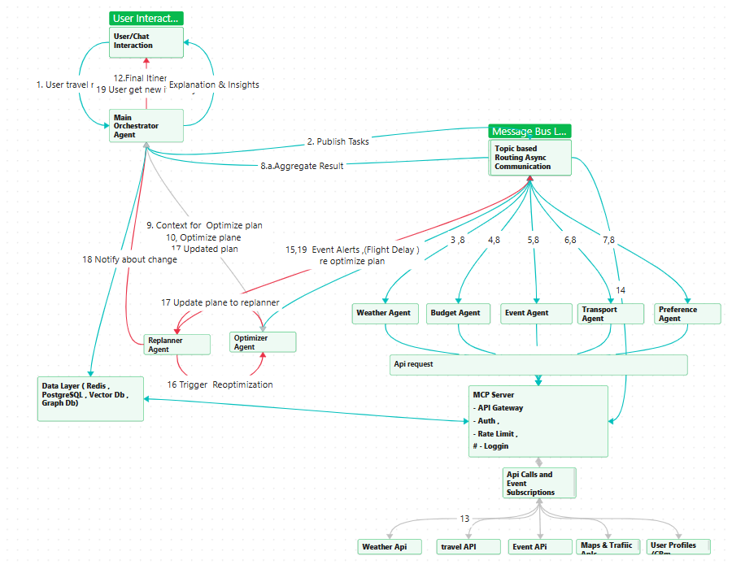

# Agentic AI Travel Planning Platform

An architecture-focused multi-agent AI system for generating personalized travel itineraries and dynamically replanning them when real-world conditions change.

> **Portfolio project:** This repository documents the system design and agent collaboration model. It is an architecture prototype, not a claim of a production deployment.

## What this project demonstrates

- Multi-agent orchestration and specialist-agent collaboration
- Event-driven coordination with Kafka/RabbitMQ concepts
- LLM-based planning, optimization, reflection, and replanning
- MCP-style tool integration for external travel services
- Short-term and long-term memory design
- Human-readable decision flow and responsible-AI considerations
- Dynamic replanning for disruptions such as flight delays and severe weather

## Architecture

The orchestrator decomposes a travel request into specialist tasks. Agents gather evidence through tool integrations, an optimizer reconciles constraints and preferences, and the replanner reacts to external disruptions.

## Agent responsibilities

| Agent | Responsibility |
| --- | --- |
| Main Orchestrator | Intent extraction, task decomposition, coordination, final response |
| Weather Agent | Forecast and weather-risk analysis |
| Budget Agent | Cost constraints and budget trade-offs |
| Event Agent | Events and destination activity context |
| Transport Agent | Routing and transport options |
| Preference Agent | User preference context and personalization |
| Optimizer Agent | Multi-objective itinerary optimization |
| Replanner Agent | Re-evaluates the plan after meaningful disruptions |

## Event-driven design

Example logical topics:

| Topic | Suggested key | Purpose |
| --- | --- | --- |
| `travel.requests` | `user_id` or `trip_id` | Preserve ordering for a trip/customer workflow |
| `agent.tasks` | `trip_id` | Dispatch work while retaining trip context |
| `agent.results` | `trip_id` | Correlate specialist-agent results |
| `optimization.requests` | `trip_id` | Initial and subsequent optimization |
| `disruption.events` | `trip_id` / affected resource | Trigger targeted replanning |

> Partition counts and routing are deployment decisions and should be based on throughput, ordering requirements, consumer parallelism, and operational measurements rather than hard-coded business categories.

## Example flow: weather-aware itinerary

1. User submits destination, dates, budget, and preferences.
2. Orchestrator creates a trip context and dispatches specialist tasks.
3. Weather Agent obtains forecast/historical context through the tool gateway.
4. Other agents evaluate budget, events, transport, and preferences.
5. Results are correlated by trip context.
6. Optimizer evaluates constraints and trade-offs.
7. Orchestrator returns an itinerary with relevant reasoning and caveats.

## Advanced flow: disruption and replanning

For a six-hour flight delay, a disruption event is associated with the affected trip. The Replanner determines which parts of the itinerary are invalidated, requests only the necessary fresh information, and sends the revised constraints to the Optimizer. The user receives an updated itinerary instead of restarting the entire planning workflow.

## Memory model

- **Working state:** current trip, task status, transient coordination state
- **Durable state:** itinerary versions, preferences, decisions, audit history
- **Semantic memory:** optional vector retrieval for preference/history context

Memory should be scoped by user/trip identity, protected by authorization controls, and assigned explicit retention policies.

## Reliability and responsible AI

A production implementation should add schema-validated events, idempotency keys, retries and dead-letter handling, distributed tracing, model/tool evaluation, rate limiting, secrets management, PII controls, audit logs, and human confirmation before consequential purchases or bookings.

## Architecture snapshots

## Repository contents

- `README.md` — portfolio-friendly architecture overview
- `Step_1_Idea_Generation.pdf` — early ideation material
- `Step_2_Documention_Agent_Architechture.docx` — detailed architecture notes
- `snap1.png`, `snap2.png` — architecture snapshots

## Next engineering milestones

- Implement a typed orchestration state model
- Add executable specialist-agent interfaces
- Add an MCP/tool gateway with mock travel providers
- Add evaluation datasets and agent/tool tests
- Add OpenTelemetry traces and operational metrics
- Containerize the demo and add CI checks
- Demonstrate a deterministic disruption/replanning scenario

---

**Focus:** Agentic AI · Multi-Agent Systems · Event-Driven Architecture · LLM Orchestration · MCP · Memory · Reliability